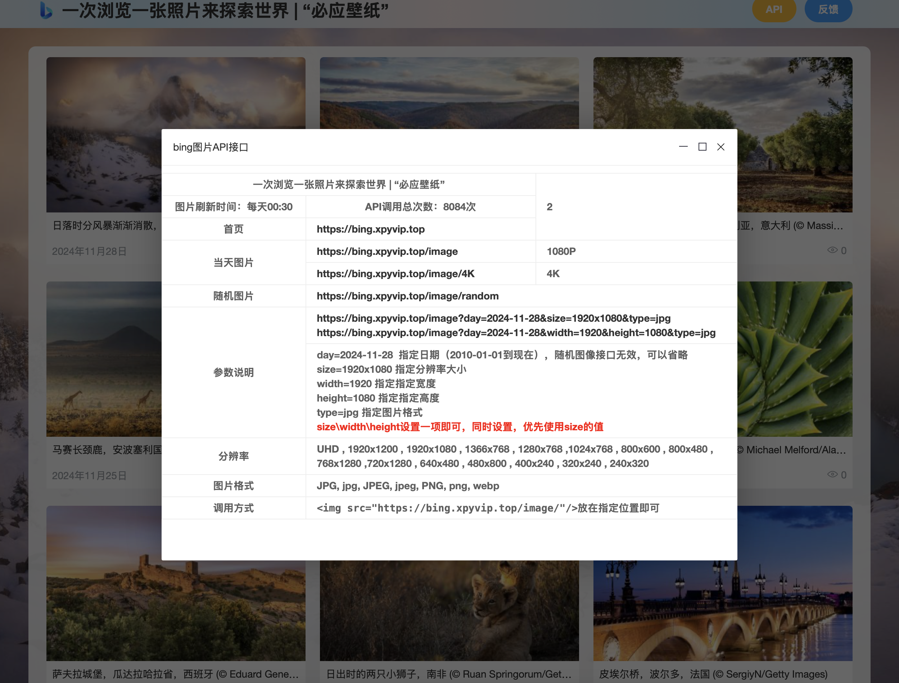
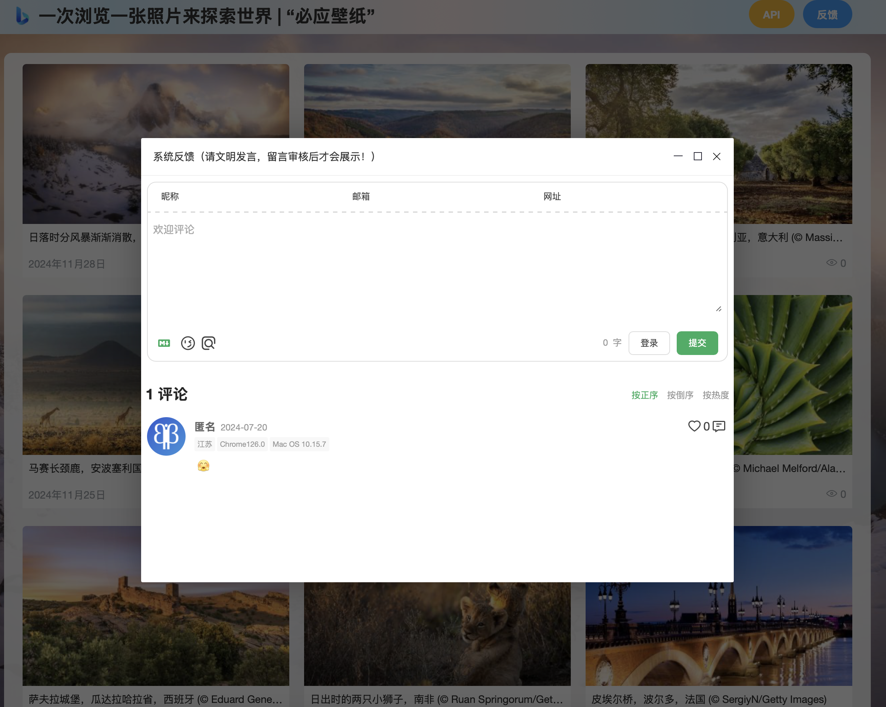

Bing Wallpaper get and display items for free, provide image API interface. [Have a look !](https://bing.xpyvip.top).

## Functionalities and roadmap

Please check the [issues](https://github.com/xpy865934/bingWallpaper-GPL/issues) to see if some feature listed to be implemented.

You have an idea of a tool? Submit a [feature request](https://github.com/xpy865934/bingWallpaper-GPL/issues/new/choose)!

## Environment Notes

- jdk17
- Spring Boot 2.7
- idea2024

## Demo legend
|                                                                                            |                                                                                            |
|--------------------------------------------------------------------------------------------|--------------------------------------------------------------------------------------------|
|                                                         |                                                         |
|                                                         |                                                         |

## License

This project is under the [GPL](LICENSE).